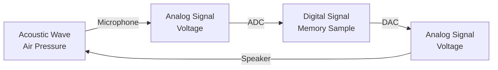
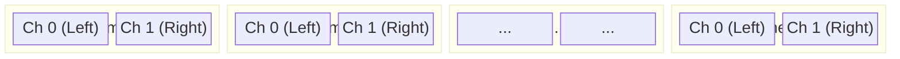

## 1. Physical Sound & Frequency

* **Sound Definition:** Sound is the physical vibration of a solid, gas, or liquid within the range of human hearing.
* **Acoustic Wave:** A propagation of pressure changes traveling through air.
* **Frequency ($f$):** The number of times air pressure changes repeat per second, measured in Hertz ($\text{Hz}$), where $1\text{ Hz} = 1\text{ s}^{-1}$.
* **Human Hearing Range:** Approximately $20\text{ Hz}$ (lowest audible tone) to $20\text{ }000\text{ Hz}$ (highest audible tone).

---

## 2. Analog and Digital Conversion

To process sound inside a computer, physical acoustic waves must undergo a two-step conversion process:

$$\text{Acoustic Wave (Pressure)} \xrightarrow{\text{Microphone}} \text{Analog Signal (Voltage)} \xrightarrow{\text{ADC}} \text{Digital Signal (Samples)}$$

* **Microphone:** A transducer converting changes in air pressure to proportional voltage changes (an analog signal).
* **Analog-to-Digital Conversion (A/D):** The process of measuring the continuous analog voltage at regular time intervals.
* **ADC:** The electronic hardware unit responsible for A/D conversion.
* **Digital-to-Analog Conversion (D/A):** The complementary process converting discrete digital samples back into a continuous analog voltage.
* **DAC:** The electronic hardware unit performing D/A conversion.
* An amplified analog signal drives a loudspeaker, transforming voltage back into physical air pressure changes.
* **Audio Interface:** Hardware containing both ADC inputs and DAC outputs, connected to a computer via USB.

---

## 3. Sampling Terminology

* **Sample:** A discrete recorded voltage value stored in memory at a specific instant.
* **Sampling Rate ($f_s$):** The total number of samples recorded per second, measured in $\text{Hz}$.
* *Synonyms:* Sample rate, sampling frequency.
* *Example:* A $1\text{-second}$ recording at $f_s = 48\text{ }000\text{ Hz}$ yields $48\text{ }000$ samples per channel.
* **Sampling Period ($T_s$):** The exact time interval between consecutive samples:

$$T_s = \frac{1}{f_s}$$

---

## 4. Audio Representation in Code & Data Structures

### Sample Values

In audio plugin processing, an individual sample is represented as a floating-point number (C++ `float` or `double`) normalized within the range $[-1, 1]$.

* Values falling outside $[-1, 1]$ at the output lead to **digital clipping** and level meter warnings in a Digital Audio Workstation (DAW).

### Structural Hierarchy

1. **Channel:** A single sequential array of samples representing one mono audio signal.
2. **Frame:** A collection of single samples across all audio channels taken at a **single point in time**.
	* **Mono Frame:** Contains $1$ sample.
	* **Stereo Frame:** Contains $2$ samples.
	* **$N$-Channel Frame:** Contains $N$ samples.
3. **Block (or Buffer):** A contiguous collection of successive frames processed together in memory.

---

## 5. Buffer Calculations & Terminology Pitfalls

* **Buffer Size ($N_{\text{frames}}$):** The number of frames contained inside a single buffer.
* **Buffer Duration ($t_{\text{buffer}}$):** The temporal length of a buffer in seconds:

$$t_{\text{buffer}} = \frac{N_{\text{frames}}}{f_s}$$

### Example Calculation

Given a sampling rate $f_s = 48\text{ }000\text{ Hz}$ and a buffer size $N_{\text{frames}} = 480$ frames:

$$t_{\text{buffer}} = \frac{480}{48\text{ }000} = 0.01\text{ seconds} = 10\text{ ms}$$

### Common Terminology Confusion

> **Warning:** Be cautious when encountering the term *"samples per block"* in documentation or APIs.
> 
> 
> * In stereo or multichannel audio, total raw sample count differs from the frame count.
> 
> 
> * A stereo buffer with $480$ frames contains $480$ samples per channel, totaling $960$ total stored scalar samples. Always distinguish whether "sample" refers to a single scalar value or a full multi-channel frame.
> 
> 
> 
>